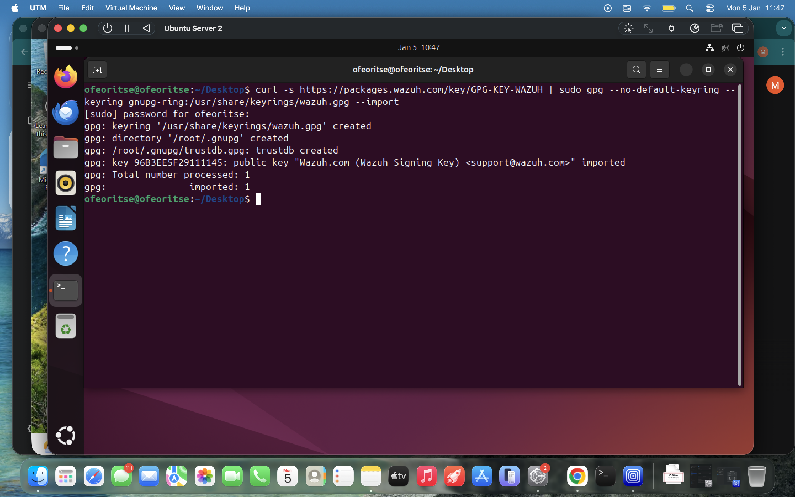
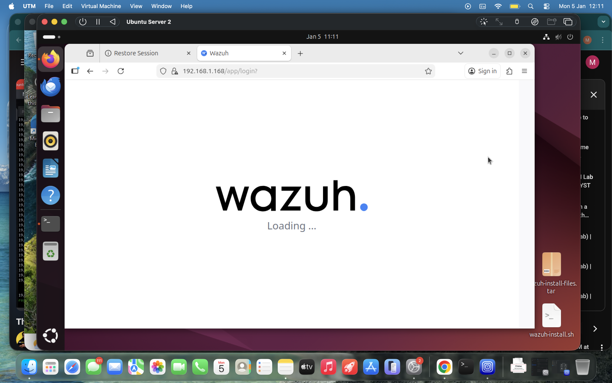
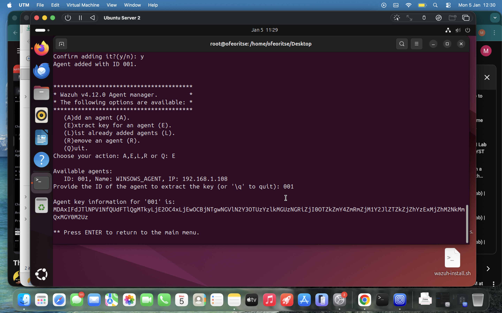
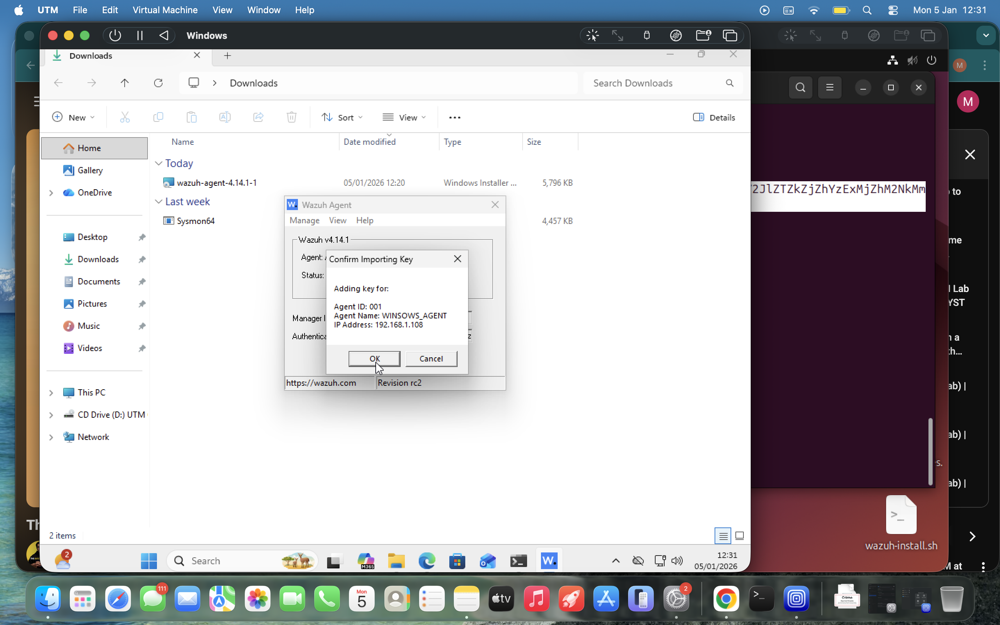
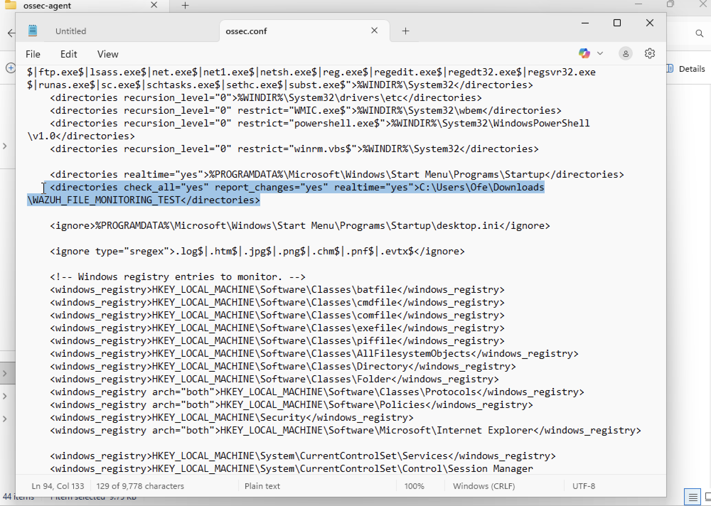
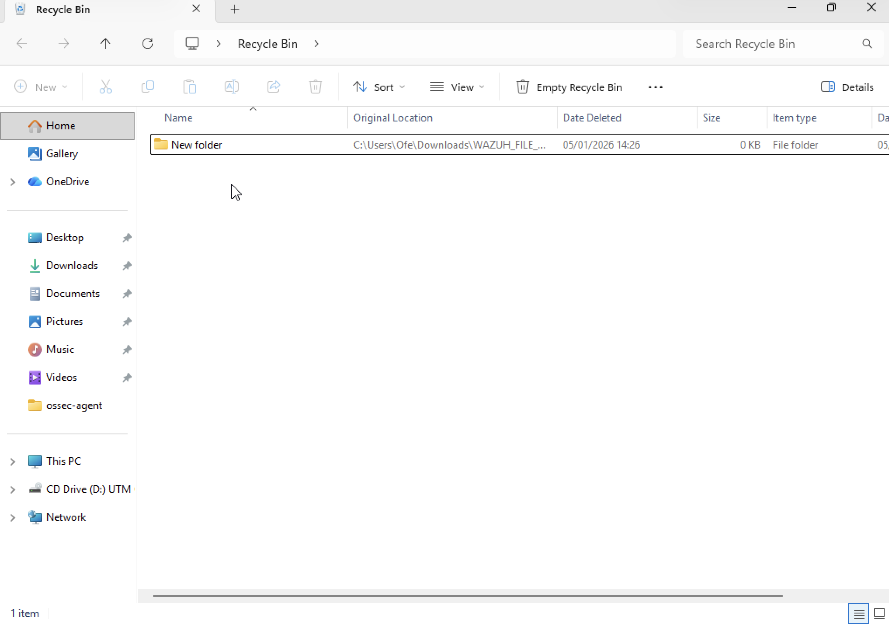
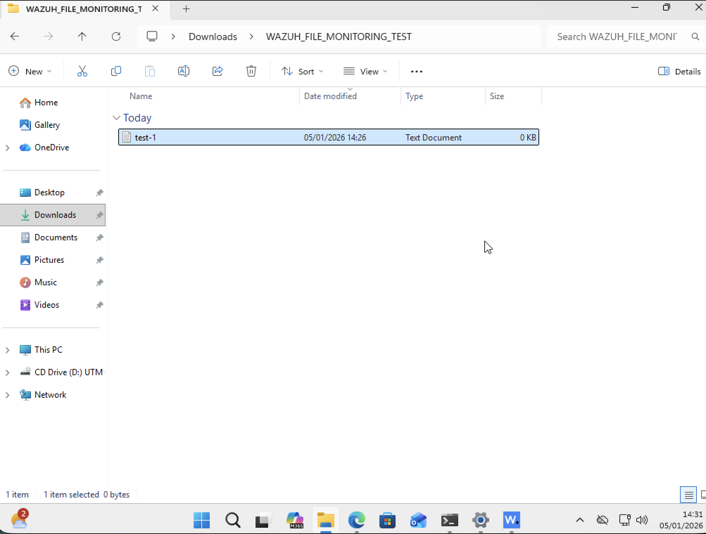
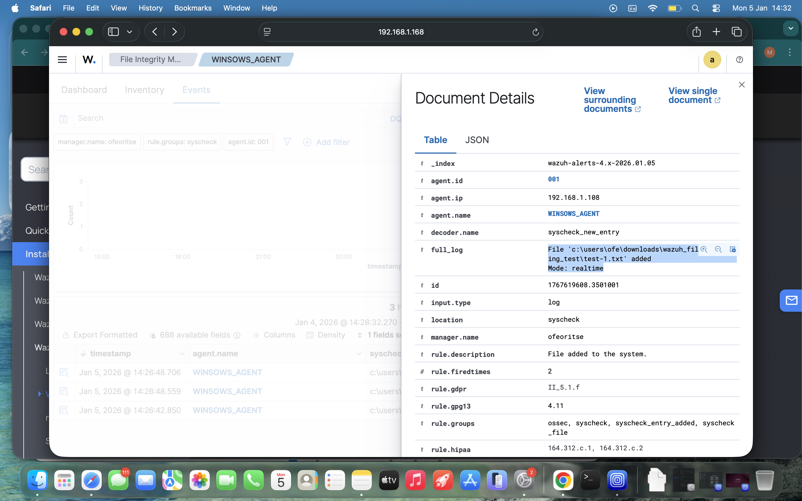

## 📖 Project Overview
This project involved deploying **Wazuh**, an open-source Security Information and Event Management (SIEM) platform, to monitor endpoint integrity. I established a manager-agent architecture to perform **File Integrity Monitoring (FIM)**, allowing for real-time detection of unauthorized file modifications on a Windows endpoint from a centralized Linux management server.

## 🛠️ Phase 1: Lab Architecture & Deployment
I utilized a cross-platform architecture to simulate an enterprise security environment.

* **Wazuh Manager:** Hosted on **Ubuntu Server** using the **UTM Hypervisor**. I configured the network settings to ensure the Manager was accessible to the host machine.
* **Wazuh Agent:** Installed on a **Windows 11** host machine.
* **Deployment:** Utilized the Wazuh installation script on the Ubuntu VM to deploy the Indexer, Server, and Dashboard components automatically.

> 
 

## 🔗 Phase 2: Agent Enrollment & Integration
Connecting the endpoint to the manager required secure authentication via shared keys.

1.  **Key Generation:** On the Ubuntu Manager, I used the `manage_agents` utility (`/var/ossec/bin/manage_agents`) to register the Windows host and extract a unique authentication key.
2.  **Agent Configuration:** On the Windows host, I used the **Wazuh Agent Manager GUI** to input the Manager's IP address and the generated key.
3.  **Verification:** Confirmed the connection via the Wazuh Dashboard, ensuring the agent status transitioned to **"Active."**

*Ubuntu Agent Key Generation*
> 
> 
*Windows GUI Agent Config*
>  

---

## 🔍 Phase 3: Configuring File Integrity Monitoring (FIM)
To move beyond basic logging, I configured the agent to monitor a specific directory in real-time.

* **Policy Editing:** Modified the `ossec.conf` file located at `C:\Program Files (x86)\ossec-agent\ossec.conf`.
* **Real-time Monitoring:** Added a specific directory block to monitor a test folder:
    ```xml
     <directories check_all="yes" report_changes="yes" realtime="yes">C:\Users\Ofe\Downloads\WAZUH_FILE_MONITORING_TEST</directories>
    ```
* **Logic:** This tells the Wazuh agent to bypass the default periodic scan and immediately report any file creation, deletion, or modification to the Manager the moment it happens.

*FIM configuration in ossec.conf*
> 

---

## 🧪 Phase 4: Attack Simulation & Detection
I simulated a "Tampering" event to verify the alert pipeline.

1.  **The Action:** Created new files and modified existing content within the monitored `C:\Users\Ofe\Downloads\WAZUH_FILE_MONITORING_TEST` folder.
2.  **The Detection:** The Wazuh Manager received the event and categorized it under **FIM Rules** (e.g, Rule ID 550 (File modified)).
3.  **Analysis:** Using the **Integrity Monitoring** dashboard, I analyzed the "Who, What, and When" of the event, confirming the SIEM was capturing granular details of the change. Alerts were categorized as medium severity and indexed under integrity_check events.

*Folder created and deleted from monitored path*
> 
> 
*File created on the monitored path
> 
> 
*Wazuh dashboard reflecting the changes*
> 

---

## 🎯 MITRE ATT&CK Mapping
| Technique ID | Technique Name | Lab Application |
| :--- | :--- | :--- |
| **T1565** | Data Manipulation | Monitored unauthorized changes to sensitive files. |
| **T1070** | Indicator Removal on Host | Detected attempts to delete log files or system configs. |
| **T1485** | Data Destruction | Identified unauthorized file deletions via FIM alerts. |

---

## 🧠 Technical Challenges & Troubleshooting
* **Hypervisor Networking:** Using **UTM**, I had to ensure the Ubuntu VM was on a network mode that allowed it to communicate with my Windows host. I adjusted the network settings to ensure a stable handshake between the Agent and Manager.
* **Agent Key Application:** Initially, the agent didn't connect after applying the key. I resolved this by manually restarting the **Wazuh Agent Service** through the GUI, which is required for the new `ossec.conf` settings and authentication keys to take effect.

---

## 🏁 Conclusion
By implementing Wazuh FIM, I created a robust "Tripwire" defense. This setup ensures that even if an attacker gains local access to a machine, any attempt to modify system files or sensitive data is instantly flagged, allowing for rapid incident response and forensic analysis.
